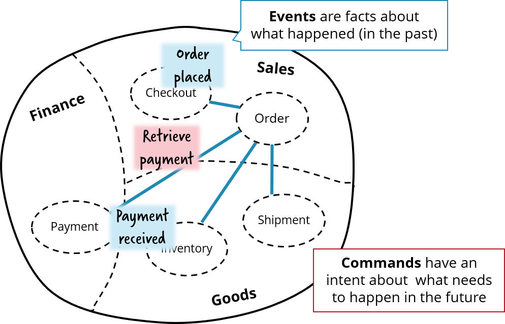

# Flowing Retail / Apache Kafka

This folder contains services that connect to Apache Kafka as means of communication between the services.


The nice thing about this architecture is, that Kafka is the only common denominator. For every service you can freely decide for

* **programming language** and
* **workflow engine**.

## Concrete technologies/frameworks:

### Java

* Java 11
* Spring Boot 2.1.x
* Spring Cloud Streams

And of course
* Apache Kafka
* Camunda or Zeebe

## Communication of services

The services have to collaborate in order to implement the overall business capability of order fulfillment. This example focues on:

* *Asynchronous* communication via Apache Kafka
* *Event-driven* wherever appropriate
* Sending *Commands* in cases you want somebody to do something, which involves that events need to be transformed into events from the component responsible for, which in our case is the Order service:



<!-- TODO If I have a business process running for several orders, how do I identify the specific business process that I need -->
# How it is work (step by step)
1. After everything has started up you are ready to visit the overview page [http://localhost:8099](http://localhost:8089)
2. You can place an order via [http://localhost:8091](http://localhost:8091)
3. **checkout** service. Rest api controller get query, create new order and send this order in topic **"flowing-retail"**
4. **order-zeebe** service. Listen **flowing-retail** topic and get order message, check type of message, and save order in db
5. **order-zeebe** service. Start bussines process with name "order-kafka" (/resource/order-kafka.bpmn). Send start proccess to using zeebe client to zeebe contatiner (zeebe:26500).
6. **order-zeebe** service. BPMN start new event **Retrieve payment** @ZeebeWorker in **RetrievePaymentAdapter** class get control, create instance of **RetrievePaymentCommandPayload** with order id and sum and send it to topic **flowing-retail**
7. **payment** service. Listen **flowing-retail** topic and get message **RetrievePaymentCommand** log data and send message in topic **flowing-retail** with message type - **PaymentReceivedEvent**
8. **order-zeebe** service. Listen **flowing-retail** topic and get message **PaymentReceivedEvent**. Call **paymentReceived** method and start next step of BPM **GoodsFetched**
9. **order-zeebe** service. BPM start next event **fetch-goods**.  @ZeebeWorker in **FetchGoodsAdapter** class get control, create instance of **FetchGoodsCommandPayload** class set message type **FetchGoodsCommand** and send to **flowing-retail** topic
10. 
11. **order-zeebe** service. Listen **flowing-retail** topic and get **FetchGoodsCommandPayload** message. Send message to BPM **"order-kafka"**, with messageName: **"FetchGoodsCommand"**
12. **order-zeebe** service. BPM start next event **ship-goods**.  @ZeebeWorker in **ShipGoodsAdapter** class get control, create instance of **ShipGoodsCommandPayload** class set message type **ShipGoodsCommand** and send to **flowing-retail** topic
13. **order-zeebe** service. Listen **flowing-retail** topic and get **ShipGoodsCommandPayload** message. Send message to BPM **"order-kafka"**, with messageName: **"ShipGoodsCommand"**


# Run the application

You can either

* Docker Compose with pre-built images from Docker Hub (simplest)
* Build (Maven) and start manually (including Zookeeper, Kafka)


## Hint on using Camunda License

The core components of Camunda are source available and free to use, but the operations tool Camunda Operate is only free for non-production use.


## Docker Compose with pre-build Docker images

* Download [docker-compose-kafka-java-order-camunda.yml](../../runner/docker-compose/docker-compose-kafka-java-orchestrated.yml) or clone this repo and goto [docker-compose/](../../runner/docker-compose/)
* Goto directory where you downloaded this file

```
cd docker-compose
```

* Start using docker compose:

```
docker-compose -f docker-compose-kafka-java-orchestrated.yml up
```

* After everything has started up you are ready to visit the overview page [http://localhost:8099](http://localhost:8089)
* You can place an order via [http://localhost:8091](http://localhost:8091)
* You can inspect processes via Camunda Operate on [http://localhost:8081](http://localhost:8081)
* You can inspect all events going on via [http://localhost:8095](http://localhost:8095)

If you like you can connect to Kafka from your local Docker host machine too.

Note that there are a couple of other docker-compose files available too, e.g. to play around with the choreography.


## Manual start (Kafka, mvn exec:java)

* Download or clone the source code
* Run a full maven build

```
cd kafka/java
mvn install
```

* Install and start Kafka on the standard port
* Create topic *"flowing-retail"*

```
kafka-topics.sh --create --zookeeper localhost:2181 --replication-factor 1 --partitions 1 --topic flowing-retail
```

* You can check & query all topics by:

```
kafka-topics.sh --list --zookeeper localhost:2181
```

* Startup your Zeebe broker as described in [Install Zeebe](https://docs.camunda.io/docs/self-managed/platform-deployment/). As an alternative you could also use [Camunda Platform 8 SaaS](https://camunda.com/get-started/)

* Start the different microservices components by Spring Boot one by one, e.g.

```
mvn -f checkout exec:java
mvn -f order-zeebe exec:java
...
```

Here you could easily switch to use order-zeebe instead.

You can also import the projects into your favorite IDE and start the following class yourself:

```
checkout/io.flowing.retail.java.CheckoutApplication
...
```

* Now you can place an order via [http://localhost:8091](http://localhost:8091)
* You can inspect processes via Camunda Operate on [http://localhost:8081](http://localhost:8081)
* You can inspect all events going on via [http://localhost:8095](http://localhost:8095)

