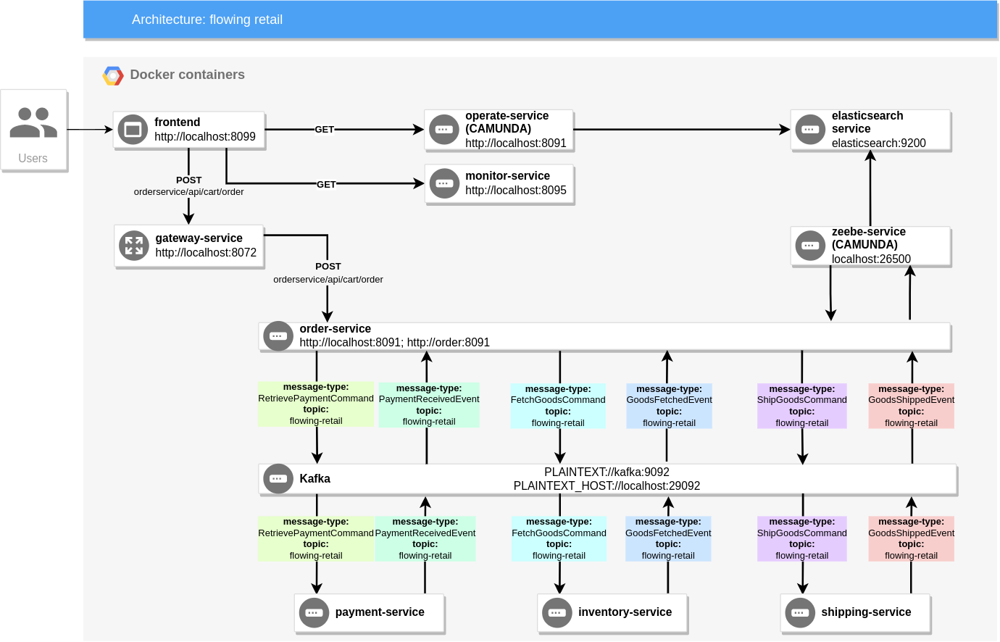
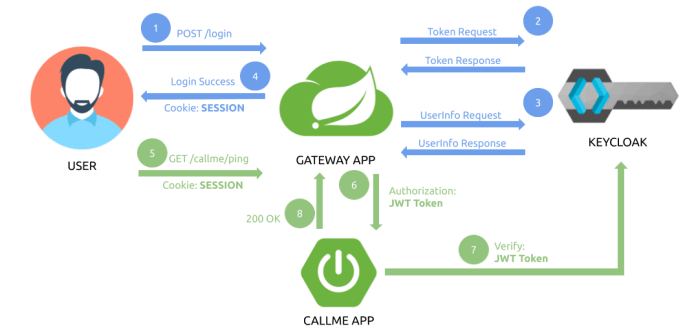

# Flowing Retail / Apache Kafka

This folder contains services that connect to Apache Kafka as means of communication between the services.


The nice thing about this architecture is, that Kafka is the only common denominator. For every service you can freely decide for

* **programming language** and
* **workflow engine**.

## Concrete technologies/frameworks:

* Java 17
* Spring Boot 2.6.x
* Kafka
* Zookeeper
* Gradle
* Spring data JPA
* Keycloak
* Lombok
* Mapstruct
* Postgresql
* Flyway
* Docker
* Kubernetes

## Communication of services

The services have to collaborate in order to implement the overall business capability of order fulfillment. This example focues on:

* *Asynchronous* communication via Apache Kafka
* *Event-driven* wherever appropriate
* Sending *Commands* in cases you want somebody to do something, which involves that events need to be transformed into events from the component responsible for, which in our case is the Order service:


# How it is work (step by step)

1. After everything has started up you are ready to visit the overview page [http://localhost:8099](http://localhost:8089)
2. You can place an order via [http://localhost:8050](http://localhost:8050)
3. **order-service** service. Rest api controller get query, create new order and save order in db
4. **order-service** service. Start bussines process with name "order-kafka" (/resource/order-kafka.bpmn). Send start proccess to using zeebe client to zeebe contatiner (zeebe:26500).
5. **order-service** service. BPMN start new event **Retrieve payment** @ZeebeWorker in **RetrievePaymentAdapter** class get control, create instance of **RetrievePaymentCommandPayload** with order id and sum and send it to topic **flowing-retail**
6. **payment** service. Listen **flowing-retail** topic and get message **RetrievePaymentCommand** log data and send message in topic **flowing-retail** with message type - **PaymentReceivedEvent**
7. **order-service** service. Listen **flowing-retail** topic and get message **PaymentReceivedEvent**. Call **paymentReceived** method and start next step of BPM **GoodsFetched**
8. **order-service** service. BPM start next event **fetch-goods**.  @ZeebeWorker in **FetchGoodsAdapter** class get control, create instance of **FetchGoodsCommandPayload** class set message type **FetchGoodsCommand** and send to **flowing-retail** topic
9. **inventory-service** service. Listen **flowing-retail** topic and get message **FetchGoodsCommand** log data and send message in topic **flowing-retail** with message type - **GoodsFetchedEvent**
10. **order-service** service. Listen **flowing-retail** topic and get **FetchGoodsCommandPayload** message. Send message to BPM **"order-kafka"**, with messageName: **"FetchGoodsCommand"**
11. **order-service** service. BPM start next event **ship-goods**.  @ZeebeWorker in **ShipGoodsAdapter** class get control, create instance of **ShipGoodsCommandPayload** class set message type **ShipGoodsCommand** and send to **flowing-retail** topic
12. **shipping** service. Listen **flowing-retail** topic and get message **ShipGoodsCommand** log data and send message in topic **flowing-retail** with message type - **GoodsShippedEvent**
13. **order-service** service. Listen **flowing-retail** topic and get **ShipGoodsCommandPayload** message. Send message to BPM **"order-kafka"**, with messageName: **"ShipGoodsCommand"**


# Run the application

You can either

* Docker Compose with pre-built images from Docker Hub (simplest)
* Build (Maven) and start manually (including Zookeeper, Kafka)

## Docker Compose

In root of project start run next command:

1. ```make create-network``` To create docker external network
2. ```make up-third-party``` This command will build and up third-party services (postgresql, kafka). These
   services separate from main project

**ATTENTION**. If you are using windows or mac os, you may encounter with problem when docker share postgresql
volume (operation not permitted). To avoid this problem, you should start third party services manually. Open folder _/docker-compose/flowing-retail-third-party_
and run next command ```docker compose up -d --build```

2. ```make build build-images up```
* **build** - create artifact (jar files) for each service
* **build-images** - packing all artifact in docker image
* **up** - start docker-compose build

After that:
* After everything has started up you are ready to visit the overview page [http://localhost:8099](http://localhost:8099)
* You can inspect all events going on via [http://localhost:8095](http://localhost:8095)

## Remote debug
I have added a debugging port for each service. You can view it in the docker compose file.


# Security. Keycloak. Oauth2 protocol
We are use keycloak. Keycloak is single sign on service based on two protocol - **OAuth2** and **OpenID connect**.

OAuth 2 is an authorization method to provide access to protected resources over the HTTP protocol. Primarily, oauth2 enables a third-party application to obtain limited access to an HTTP service

OpenID Connect (OIDC) is a protocol for authorization, the top layer of the oauth2 protocol that provides authentication and provides information about the user (identity token or JWT). I.e. if the service supports OIDC, then it can be considered an identity provider (idp)

All microservices registered in keycloak as trusted clients and call keycloak to validate jwt token. 


OAuth defines 4 roles:
 - **Resource Owner (fr_user)** – The user of the application.
 - **Client (gateway-service)** – the application (user is using) which require access to user data on the resource server.
 - **Resource Server (product-service, order-service, ...)** – store user’s data and http services which can return user data to authenticated clients.
 - **Authorization Server (keycloak)** – responsible for authenticating user’s identity and gives an authorization token. This token is accepted by resource server and validate your identity.

## Configure keycloak
1. Create new realm - **flowing-realm**
2. Create new user - **retail_user**
3. Create clients scope - **message.read** and **message.write**
4. Create client - **flowing-client**. 
   1. Add client scopes, 
   2. Set **redirect url** - http://localhost:3000/login/oauth2/code/gateway and http://gateway-service:3000/login/oauth2/code/gateway
   3. Set **access type** - confidential
   4. copy **client-secret** from credential tab
5. WARNING. Required set tokenRelay in gateway routing config



## How security work
We have created user with scope in keycloak. Client delegated the authentication to keycloak. 
**Gateway-service** added as trusted client in keycloak, this means that the gateway will be for authentication on keycloak. Get a token, update a token

1. GET access to resource http://localhost:3000/productsvc/api/v1/product
2. Gateway redirect request to keycloak to login and issue token
3. Keycloak check username and password and create access token
4. Redirect back to gateway with token
5. Gateway redirect to resource service
6. Resource service send token to keycloak to verify it
7. After verification is completed, resource service return response